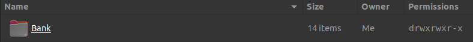
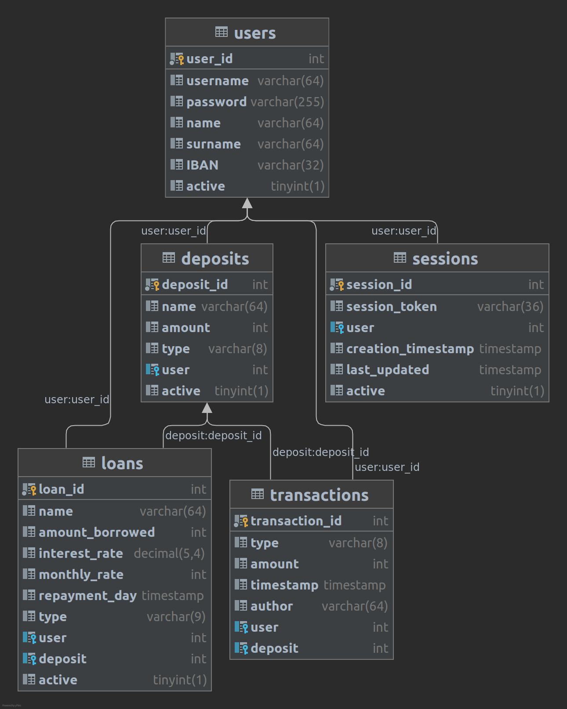

# Bank REST Server

## LAMP application

> ### Warning
> This is a utility guide to set up the project.  
> Some steps may be superficial (like the installations)  
> It's suggested to follow this tutorial:
>
> - [How To Install Linux, Apache, MySQL, PHP (LAMP) stack on Ubuntu 20.04](https://www.digitalocean.com/community/tutorials/how-to-install-linux-apache-mysql-php-lamp-stack-on-ubuntu-20-04)
> - [How To Install and Secure phpMyAdmin on Ubuntu 20.04](https://www.digitalocean.com/community/tutorials/how-to-install-linux-apache-mysql-php-lamp-stack-on-ubuntu-20-04)
> - [How To Create a New User and Grant Permissions in MySQL](https://www.digitalocean.com/community/tutorials/how-to-create-a-new-user-and-grant-permissions-in-mysql)
> - [How To Install and Use Composer on Ubuntu 20.04](https://www.digitalocean.com/community/tutorials/how-to-install-and-use-composer-on-ubuntu-20-04)
> - [Install PHP 8 on Ubuntu 20.04](https://medium.com/techiediaries-com/install-php-8-on-ubuntu-20-04-b53f76ef1d62)

### Environment

**L**inux Ubuntu 20.04.2 Kernel 5.11.0-43-generic

**A**pache 2.4.41-4ubuntu3.8

**M**ySQL 8.0.27-0ubuntu0.20.04.1

**P**HP 8.0.14

### Apache Server

Install the server from the bash using:

`sudo apt install apache2`

#### Server configurations

Enable the RewriteRules from the bash with:

`sudo a2enmod rewrite`

In the file /etc/apache2/apache2.conf add:

```
# This is the main Apache server configuration file. It contains the   
[...]

<Directory **/absolute/path/to/your/project/directory**&gt;  
    RewriteEngine on   
    AllowOverride All   
    Require all granted  
</Directory>

[...]
```

The path mustn't contain trailing /  
The directory should be under the current user ownership:



In case it is not, type:

<code>sudo chown **you**:**yourGroup** **path/to/your/project/directory**</code>

#### Logging

In case you need to debug server errors it is suggested to add:

```
# LogLevel: Control the severity of messages logged to the error_log.   
[...]  
LogLevel alert rewrite:trace6
```

The log files can be found in:  
`/var/log/apache2/access.log`

The error log can be found in:  
`/var/log/apache2/error.log`

#### Project domain configuration

under `/etc/apache2/sites-available` add `bank.com.conf` (in general `your.domain.conf`)  
and write:

```
<VirtualHost *:80>  
    ServerAdmin admin@bank.com  
    ServerName bank.com  
    ServerAlias www.bank.com  
    DocumentRoot /absolute/path/to/your/project/directory  
    Alias /api /absolute/path/to/your/project/directory/src/endpoints  
    ErrorLog ${APACHE_LOG_DIR}/error.log  
    CustomLog ${APACHE_LOG_DIR}/access.log combined  
</VirtualHost>
```

Use the bash to enable the domain:

`sudo a2ensite bank.com.conf`

And finally make it visible in your machine by adding the domain inside the file `/etc/hosts`:

```
# Bank server address  
127.0.1.1   bank.com
```

#### Test correct configuration

To check if it all went well type:

`sudo apache2ctl configtest`

You should expect `Syntax OK`

### MySQL database

Install the service with:

`sudo apt install mysql-server`

#### Database user

enter the CLI with:

`sudo mysql`

In this modality you're using the root, to add a user for future uses type:

```mysql
CREATE USER 'user'@'localhost' IDENTIFIED BY 'password';
```

and

```mysql
GRANT ALL PRIVILEGES ON *.* TO 'user'@'localhost';
```

In this project the database user is called 'giacomo' with password ''.  
It is written in `/src/Specification/Database/Database.php`

#### Database schema

First create the database using the mysql CLI:

```mysql
CREATE DATABASE bank
```

Then define the DDLs:

```mysql
CREATE TABLE users
(
    user_id  INTEGER NOT NULL AUTO_INCREMENT,
    username VARCHAR(64),
    password VARCHAR(255),
    name     VARCHAR(64),
    surname  VARCHAR(64),
    IBAN     VARCHAR(32),
    active   BOOLEAN,
    PRIMARY KEY (user_id)
);
```

```mysql
CREATE TABLE deposits
(
    deposit_id INTEGER NOT NULL AUTO_INCREMENT,
    name       VARCHAR(64),
    amount     INTEGER,
    type       VARCHAR(8),
    user       INTEGER,
    active     BOOLEAN,
    PRIMARY KEY (deposit_id),
    FOREIGN KEY (user)
        REFERENCES users (user_id)
        ON DELETE CASCADE
);
```

```mysql
CREATE TABLE transactions
(
    transaction_id INTEGER NOT NULL AUTO_INCREMENT,
    type           VARCHAR(8),
    amount         INTEGER,
    timestamp      TIMESTAMP,
    author         VARCHAR(64),
    user           INTEGER,
    deposit        INTEGER,
    PRIMARY KEY (transaction_id),
    FOREIGN KEY (user)
        REFERENCES users (user_id)
        ON DELETE CASCADE,
    FOREIGN KEY (deposit)
        REFERENCES deposits (deposit_id)
        ON DELETE CASCADE
);
```

```mysql
CREATE TABLE loans
(
    loan_id         INTEGER NOT NULL AUTO_INCREMENT,
    name            VARCHAR(64),
    amount_borrowed INTEGER,
    interest_rate   DECIMAL(5, 4),
    monthly_rate    INTEGER,
    repayment_day   TIMESTAMP,
    type            VARCHAR(9),
    user            INTEGER,
    deposit         INTEGER,
    active          BOOLEAN,
    PRIMARY KEY (loan_id),
    FOREIGN KEY (user)
        REFERENCES users (user_id)
        ON DELETE CASCADE,
    FOREIGN KEY (deposit)
        REFERENCES deposits (deposit_id)
        ON DELETE CASCADE
);
```

```mysql
CREATE TABLE sessions
(
    session_id         INTEGER NOT NULL AUTO_INCREMENT,
    session_token      VARCHAR(36),
    user               INTEGER,
    creation_timestamp TIMESTAMP,
    last_updated       TIMESTAMP,
    active             BOOLEAN,
    PRIMARY KEY (session_id),
    FOREIGN KEY (user)
        REFERENCES users (user_id)
        ON DELETE CASCADE
);
```

The schema diagram should correspond to this:  


#### phpMyAdmin

If you prefer having a visual assistance tool, you can install phpMyAdmin
following [this tutorial](https://www.digitalocean.com/community/tutorials/how-to-install-linux-apache-mysql-php-lamp-stack-on-ubuntu-20-04)

Because the database user have no password you to allow phpMyAdmin to have this kind of user by go to the
file `/etc/phpMyAdmin/config.inc.php` and change line 98, as the comment suggest:

```injectablephp
$cfg['Servers'][$i]['AllowNoPassword'] = TRUE;
```

### PHP runtime

Install the dependency with:

`sudo apt install software-properties-common`  
`sudo add-apt-repository ppa:ondrej/php`  
`sudo apt update`  
`sudo apt install php8.0`

Since by default Apache use php 7.4, you need to change it, by typing:

`sudo a2dismod php7.4`  
`sudo a2enmod php8.0`

#### Composer

Finally, you need to add composer to the machine, by
following [this tutorial](https://www.digitalocean.com/community/tutorials/how-to-install-and-use-composer-on-ubuntu-20-04)

Type `composer install` in your project directory and the `vendor` directory, containing the project dependencies, will
appear

### Test

To test either the application run with PHPUnit the scripts under the `test` directory or use
the [insomnia tool](https://insomnia.rest/) and add the collection by clicking the "create" button and "import from
file".  
Choose the yaml file included in the project under `test/Insomnia/Insomnia_2021-12-29.yaml`
